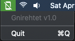
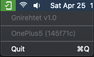

# Gnirehtet (v1.0)

This project is a wrapper around Genymobile's [gnirehtet tool][gnirehtet]. It
provides **reverse tethering** over `adb` for Android, allowing devices to use
the Internet connection of the computer they are plugged into. It does not
require any _root_ access (neither on the device nor on the computer). The
wrapper allows Android devices to be automatically detected and configured as
clients.

Gnirehtet v1.0 comes packaged with [gnirehtet v2.4] and [adb v1.0.41][adb]. No
additional software is required.

[adb]: https://developer.android.com/studio/command-line/adb.html
[gnirehtet]: https://github.com/Genymobile/gnirehtet
[gnirehtet v2.4]: https://github.com/Genymobile/gnirehtet/releases/tag/v2.4

## Requirements

The Android application requires at least API 21 (Android 5.0). You must also
[enable adb debugging][enable-adb] on your device(s).

[enable-adb]: https://developer.android.com/studio/command-line/adb.html#Enabling

## Download

Download the [latest release][latest] for macOS.

[latest]: https://github.com/RyanWirth/gnirehtet/releases/latest

## Run

Simply run `Gnirehtet.app`. The program lives as a menu bar extra in the top
right corner of your screen:

Attach your Android device and a popup to request permission should open:

A "key" icon appears in your device's status bar whenever _Gnirehtet_ is
active:

Additionally, the menu bar extra lists all active devices:

## Licence

    Copyright (C) 2020 Ryan Wirth
    Copyright (C) 2017 Genymobile

    Licensed under the Apache License, Version 2.0 (the "License");
    you may not use this file except in compliance with the License.
    You may obtain a copy of the License at

        http://www.apache.org/licenses/LICENSE-2.0

    Unless required by applicable law or agreed to in writing, software
    distributed under the License is distributed on an "AS IS" BASIS,
    WITHOUT WARRANTIES OR CONDITIONS OF ANY KIND, either express or implied.
    See the License for the specific language governing permissions and
    limitations under the License.
